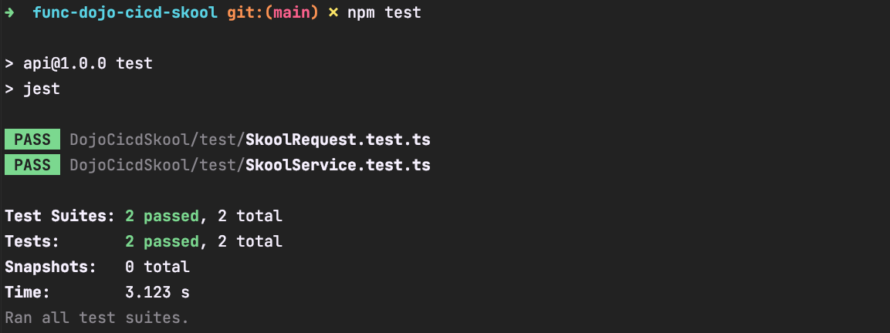
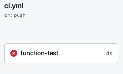
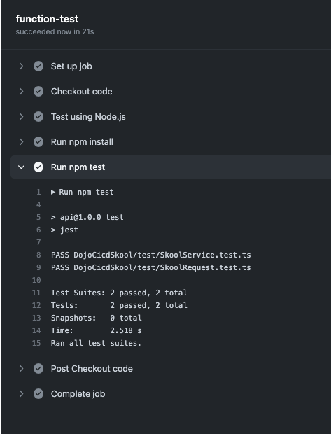
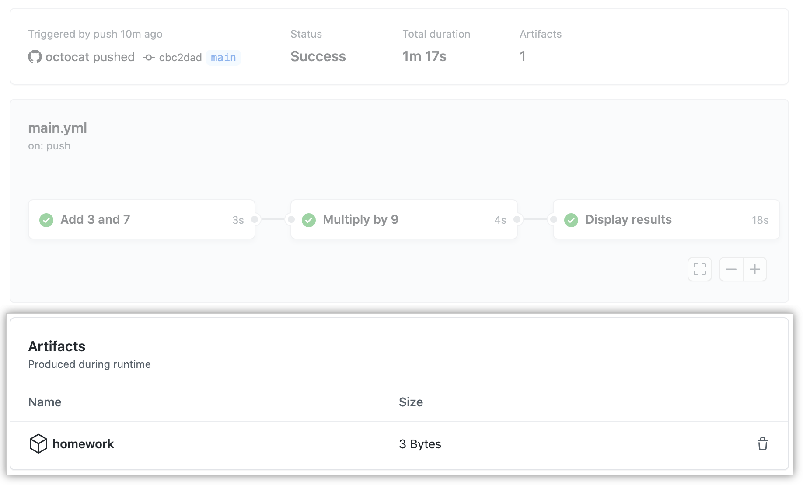
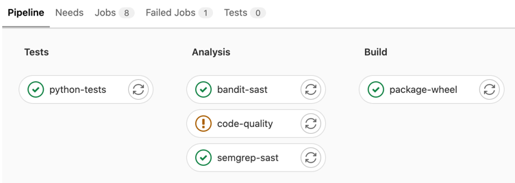

summary: dojo - cicd devops
id: dojo-cicd-codelab-markdown
categories: exercice 
tags: exercice 
status: Published 
authors: ANTE
Feedback Link: https://github.com/tehioant/Dojo-cicd-devops-octo/issues/new

# DOJO - CI/CD DevOps

## Overview
Duration: 0:02:00

Objectifs pédagogique :

- Découvrir les concepts autour de l'intégration continue,
- Programmer un pipeline d'intégration continue/une usine de développement logiciel,
- Obtenir du feedback fréquemment grâce aux tests automatisés,
- Mesurer la qualité de son code,
- Automatiser la production d'artéfacts,
- Creer une pipeline de release par tag.

👉 [Dispo sur le drive OCTO](https://docs.google.com/presentation/d/1kRS86ba0FT6grKMrwFyHaTTzEwl_cAeZE8Euqx3e9kM/edit#slide=id.g804284dca3_0_176).

## Presentation
Duration: 0:05:00


### Environment

Ce produit comprend une Azure Function App `func-dojo-cicd-skool` composée d'une fonction en TypeScript nommé `DojoCicdSkool`.\
Les developpeurs construisent une API.
Pour permettre cela et produire du code de qualité, il faut de l'automatisation et de l'outillage 🛠. \
Cet outillage, il s'agit généralement d'une pipeline, et on va en construire une en utilisant Github actions pendant ce dojo 💃

Le repository a 2 pipelines qui ont besoin d'être créé :
* ci.yml
* release.yml


```text
Definition:
Continuous Integration is a software development practice where members of a team 
integrate their work frequently, usually each person integrates at least daily, 
leading to multiple integrations per day.
```

La pipeline doit contenir les jobs suivants:
- Lint
- Unit tests
- Build
- Integration tests


Pour les curieux qui veulent aller + loin sur la notion d'intégration continue :

- <https://www.martinfowler.com/articles/continuousIntegration.html>
- <https://blog.octo.com/tag/continuous-integration/>

## Step 1 - Tests automatisés
Duration: 0:10:00

**🎯 Goal** : je veux obtenir du feedback sur le produit que je développe via les tests

### Local testing

```plaintext
> 🕵️‍ Automatiser, c'est rendre automatique une action qui était jusque-là manuelle 💪
```

**👉 First, run tests on you computer !** 

Au passage, prenez en note dans un fichier :
- les pré-requis : les commandes ou paquets que vous avez dû installer pour pouvoir lancer les tests,
- le résultat attendu : logs affichés en console, fichiers de rapport produits, ...

🏁 Exemple de résultat attendu en lançant les tests en local avec

```shell
$ npm test
```



### Tips

Vous pouvez utiliser Makefile pour opérer votre projet et faciliter son utilisation par tous.\
Par example: ```$ make test```

## Step 2 - Tests automatisés (CI)
Duration: 0:15:00

**🎯 Objectif** : Je veux obtenir du feedback sur mes tests à chaque commit poussé sur ma branche de travail.

**Rendu attendu à la fin de ce TP2** : \
En poussant du code sur ma branche de travail, un pipeline doit se lancer automatiquement sur github. Cette pipeline doit permettre d'exécuter les tests avec Jest, comme ceci quand les tests sont au vert :


ℹ️ Tips: 
- Vous pouvez utiliser `ubuntu` comme image de **stage**.
- Il est conseillé de définir les versions des objets que vous utilisez.

### Tests dans le pipeline de CI

👉 Edit the following file [ci.yml](../.github/workflows/ci.yml) and add a stage named `function-tests`.


|                   .                   |                   .                   |
|:-------------------------------------:|:-------------------------------------:|
| ✅ Succès si tous les tests sont verts | 🔴 Echec si au moins 1 test est rouge |
|        |          |

**🏁 Test de recette** : Si la step `function-tests` s'exécute bien dans votre pipeline de CI,
- elle devrait arborer une coche verte, 
  -  
- et afficher les logs d'exécution de la commande Jest en console.
  - 

ℹ️ Si vous ne savez pas comment faire éditer le pipeline, la partie ci-après vous donnera un premier vernis sur les pipelines github et leur déclaration en YAML.

```yaml
## Un exemple de fichier ci.yml

env:
  FOO: bar

jobs:
  example-variable-1:
    runs-on: ubuntu-latest
    steps:
      - run: echo “$FOO” # bar

  example-variable-2:
    runs-on: ubuntu-latest
    env:
      FOO: override_at_job_level
    steps:
      - run: echo “$FOO” # override_at_job_level
```

## Step 3 - Jest report (bonus)
Duration: 0:20:00

```plaintext
⚠️ Si vous vous sentez en retard; laissez de coté ce bonus; 
Vous pourrez y revenir plus tard 📅 🎱 🔮
```

1. Dans le job `function-tests`, faites en sorte que `jest`  calcule la couverture de tests sur la fonction `DojoCicdSkool` et produise la mesure de couverture en console.
   1. Vous pouvez utiliser [la commande --coverage](https://jestjs.io/docs/cli) pour y arriver.
2. Changez la destination de production de ces rapports afin de les produire dans un dossier [reports/jest/](../reports/jest) à la racine du repo.
3. Render les rapports du dossier `reports/` accessibles sous la forme d'artéfacts.
4. Un exemple d'utilisation de [la fonctionnalité d'artéfact](https://docs.github.com/en/actions/using-workflows/storing-workflow-data-as-artifacts).

**🏁 Test de recette : les rapports sont disponibles dans la partie Artifacts comme suit:**



## Step 4 : Mesure de la qualité du code (local)
Duration: 0:20:00

```plaintext
🎯 Objectif : Je veux obtenir du feedback sur la qualité du code sur commande.
```

👨‍👨‍👧‍👦 La qualité du code, c'est une notion subjective qui se définit généralement en équipe.
📊 Une fois qu'on l'a défini collectivement, on peut définir des indicateurs pour la mesurer.
📦 Certains package Typescript peuvent produire de tels indicateurs.

**Par exemple :**

- [es-lint](https://typescript-eslint.io/) est un linter de code TypeScript sur le style. Le nombre de warnings peut donner une indication de
la _compliance_ du code que l'on a produit avec les standards de style reconnus dans 
l'écosystème TypeScript.
👉 On pourrait définir que du code de qualité, c'est du code qui respecte ces standards définis par l'équipe et dont
le nombre de warning tend vers 0.
**Es-lint** inclus **prettier** dans son package. Vous pouvez définir vos règles d'indentation pour conserver une continuité dans l'équipe.


- [sonarqube](https://docs.sonarqube.org/9.6/analyzing-source-code/languages/javascript-typescript-css/)
 est un outil de revue de code automatique et autogérer qui vous aide systématiquement à fournir du **clean code**.
Il donne un grand nombre d'indications sur votre code et vos tests. Il permet de mesurer la couverture du code par les tests, c-a-d le ratio du nombre de lignes de code source traversé par les tests sur le nombre de lignes de code total.
Il permet aussi de detecter un certains nombre de failles de sécurité tant dans le code que dans les CVE (Common vulnerabilities and exposures).
👉 On pourrait définir que du code de qualité, c'est du code où chaque ligne est testée, 
donc du code où le code coverage tend vers 100% (ou du moins dépasse un seuil élevé, ex: 80%).

- [audit-ci](https://github.com/IBM/audit-ci) est un outil concu pour le continuous integration qui nous permet de prevenir l'intégration de code et de paquets contenant des vulnérabilités.
Vous pouvez customiser vos règles afin de filtrer vos autorisations.

👉 Insérez vos métriques favorites ici pour mesurer la qualité du code ou auditer du code 🤓
- Respect des ratios de la pyramide de tests,
- Respect de la clean architecture,
- Absence de code mort,
- Nombre de bugs,
- Seuil de complexité cyclomatique,
- Métriques de sécurité (nombre de failles/CVE dans le code ou les dépendances),
- Métriques Accelerate (Lead time, MTTR, ...),
- ... 

🏁 **Objectifs :**

```plaintext
> 🕵️‍ Automatiser, c'est rendre automatique une action qui était jusque-là manuelle 💪
```

👉 Commencez par essayer de mesurer la qualité du code en local ! 

Sur votre poste local, installez les outils suivant, mesurez la qualité de votre code en ligne de commande et affichez les résultats de mesure en console avec :
- es-lint
- audit-ci
- sonar

🎯 Mesurez les indicateurs suivant sur vos postes, en local :

- Nombre de warnings sur le style du code avec es-lint,
- Faites des analyses de sécurité avec audit-ci et sonar,

Comme précédemment, prenez en note :
- les pré-requis : les commandes ou paquets que vous avez dû installer pour pouvoir lancer les tests,
- la commande que vous avez exécuter pour lancer les tests,
- le résultat attendu : logs affichés en console, fichiers de rapport produits, ...

Cela nous servira pour reproduire cela dans notre pipeline de CI dans le prochain exercice.

## Step 5 : Mesure de la qualité du code (CI)
Duration: 0:20:00

```plaintext
🎯 Objectif : Je veux obtenir du feedback sur la qualité du code automatiquement à chaque push d'un commit.
```

Le pipeline doit permettre 
- d'exécuter les tests avec Jest, 
- puis si les tests sont verts; exécuter les étapes de mesure la qualité du code dans un stage `code-quality` comme ceci :


- ✅ Le stage `code-quality` sera vert si votre base de code respecte les standards de es-lint, audit-ci, sonar (en bonus).
- 🔴 Le stage `code-quality` sera rouge si l'un de ces outils d'analyse relève au moins 1 warning.

### Autoriser l'échec d'une step

Dans le TP suivant, nous allons ajouter une step supplémentaire au pipeline pour packager automatiquement l'application 
- si les tests sont verts,
- et si le code produit est "de qualité suffisante".

En l'état, le code Python n'est pas "parfait" concernant les outils d'analyse que nous utilisons : il y a quelques warnings notables avec jest et sonar par exemple.

S'il est utile de savoir que ces warnings existent, et qu'il faudra les corriger, nous ne souhaitons pas pour autant que le pipeline de CI s'arrête sur cette étape `code-quality`.

Pour permettre au pipeline de continuer, github propose la fonctionnalité [continue-on-error](https://docs.github.com/en/actions/using-workflows/workflow-syntax-for-github-actions#jobsjob_idstepscontinue-on-error).

🏁 **Objectif : utilisez la fonctionnalité _continue-on-error_ sur le stage `code-quality` pour permettre au pipeline de ne pas s'arrêter même s'il échoue sur celui-ci.**

**Rendu attendu** :

- ✅ Le stage `code-quality` sera vert si votre base de code respecte les standards de es-lint, audit-ci, sonar (en bonus).
- ⚠️ Le stage `code-quality` sera orange si l'un de ces outils d'analyse relève au moins 1 warning.

- 

## Step 6 : Packager du code de qualité (local)
Duration: 0:20:00

```plaintext
🎯 Objectif : Je veux packager du code automatiquement.
```

```shell
cd func-dojo-cicd-skool;
npm run build
```
🏁 **Objectif 1 : Packagez l'application en local.**

🍜 Test de recette : un dossier de la fonction devrait être apparu dans le dossier dist/ ❗️

🏁 **Objectif 2 : Changez la version de l'application en 1.18.27 avant de la packager.**

ℹ️ Tips: vous pouvez utiliser la commande ```npm version patch``` \
🍜 Test de recette : le package possède la version **1.18.27**, use ```npm version```

## Step 7 : Packager du code de qualité (en CI)
Duration: 01:00:00

```plaintext
🎯 Objectif : je veux packager du code automatiquement à chaque push d'un commit, si et seulement si les tests passent et la qualité du code est acceptable.
```

Le pipeline doit permettre 
- d'éxécuter les tests avec jest, 
- puis si les tests sont verts : exécuter les étapes de mesure la qualité du code dans un stage `code-quality`
- puis si les tests sont verts et la qualité OK : packager le code et bump la version.

🏁 **Objectif 1 : Packagez l'application en local au format Wheel.**

🍜 Test de recette : une nouvelle step `package-function` un nouveau stage `build` dans le pipeline de CI doit permettre de produire un dossier comme ceci : 



️🏁 **Objectif 2 : Rendre le package accessible en artéfact.**

🍜 Test de recette : la step `package-function` doit exposer le contenu du dossier dist/ en artéfact afin de rendre le dossier téléchargeable depuis l'interface web : 


## BONUS : Deployer son artefact sur Azure (en CD)

```plaintext
🎯 Objectif : Je veux deployer mon artefact sur Azure
```

Dans ce dernier step Bonus, vous êtes en autonomie. 
Nous voulons déployer notre fonction sur un service Azure (Azure Function App). Pour ce faire, modifiez le code Terraform pour créer votre Azf et les resources nécessaires.
Dans un nouveau stage `deploy`, lancer les commandes Terraform requis et publier votre artefact.

⛔️ Important : Ne changez pas les skus du Terraform. Les resources doivent rester en free tier.

🍜 Test de recette : Une Azure Function App est déployée sur le cloud et je peux appeler ma fonction en Http.